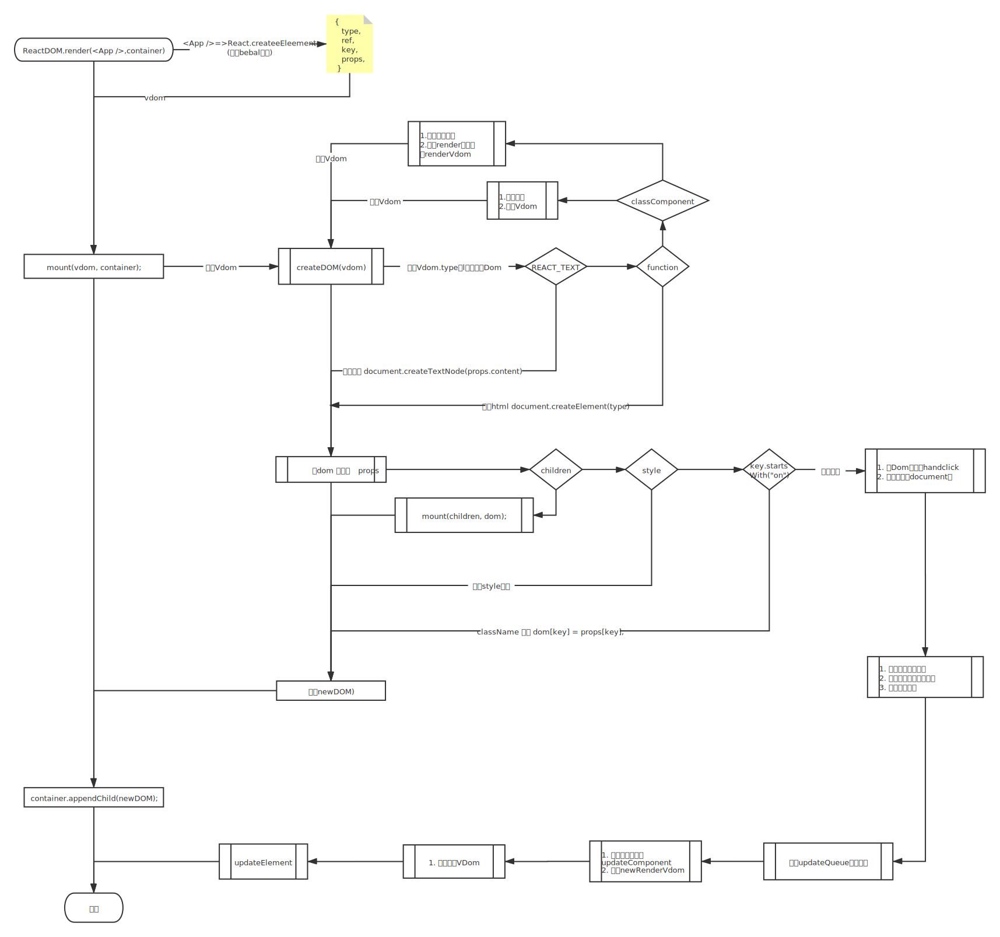

# 简版 React 实现

- React 最新版本的 React.createElement 已迁移到 jsx-runtime 实现
  - 项目搭建采用 chtty-cli 创建 React16 版本进行源码实现探究
- 目的
  - 了解 React.createElement
  - 事件代理
  - 虚拟 vDom 对比
  - 更新流程
- 流程图
  

> google react 源码解析
