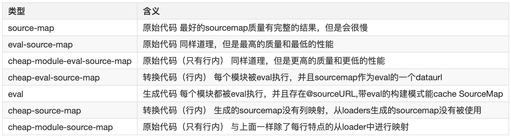

# sourceMap

* 什么是sourceMap

 

    Source map就是一个JSON格式的信息文件，里面存储着位置信息，即每一个位置转换前与转换后的位置关系。

* 为什么需要sourceMap

    
    工程上线或者经过编译之后的代码不便于定位问题，我们需要将编译后的出错的代码映射到源码中以便于理解和快速定位你问题

* 如何生产sourceMap
  + 工程中如何生成
    - webpack=>devtools
      - 



  + 手动生产
    - java -jar compiler.jar  --js script.js  --create_source_map ./script-min.js.map  --source_map_format=V3  --js_output_file script-min.js
* sourceMap映射原理
  + 字段解析

  

``` js
        {
          "version": 3,
          "file": "script-min.js", // 转换后的文件
          "lineCount": 1,
          "mappings": "AAAA,IAAIA,EAAI,CAAR,CACIC,EAAI,CADR,CAEIC,EAAI;", // 位置对应关系
          "sources": ["script.js"], // 源文件
          "names": ["a", "b", "c"] // 变量
          //sourceRoot 转换前的文件所在的目录。如果与转换前的文件在同一目录，该项为空。
        }
```

  + 位置对应关系解读
    - 第一层是行对应
      - 以封号(; )间隔，每一个分号对应源码的一行，第一个分号前面的内容对应源码的第一行
    - 第二层是位置对应
      - 以逗号(, )间隔，每一个逗号标识一个位置
    - 第三层是位置转换
      - 代表该位置对应的转换前的源码位置
      - 第一位，表示这个位置在（转换后的代码的）的第几列。
      - 第二位，表示这个位置属于sources属性中的哪一个文件。
      - 第三位，表示这个位置属于转换前代码的第几行。
      - 第四位，表示这个位置属于转换前代码的第几列。
      - 第五位，表示这个位置属于names属性中的哪一个变量。可有可无

      
      

``` js
[0, 0, 0, 0], [4, 0, 0, 4, 0], [3, 0, 0, 5], [1, 0, 0, -9], [1, 0, 1, 4, 1], [2, 0, 0, 4], [1, 0, -1, -8], [1, 0, 2, 4, 1], [4, 0, 0, 6]
```

    - 位置移动

     

| 位置对应         | 转换后位置 | 转换前位置                    | 变量位置 | 文件位置 |
|-----------------|----------|------------------------------|--------|--------|
| [0, 0, 0, 0]    | var左边界 | let左边界                     |        |        |
| [4, 0, 0, 4, 0] | aa左边界  | aa左边界                      |        |        |
| [3, 0, 0, 5]    | 1左边界   | 1左边界                       |        |        |
| [1, 0, 0, -9]   | , 左边界  | 折回行头let左边界              |        |        |
| [1, 0, 1, 4, 1] | b左边界   | 向下1行，b的左边界              |        |        |
| [2, 0, 0, 4]    | 2左边界   | 行不动，向右4位，到2做左边界      |        |        |
| [1, 0, -1, -8]  | , 左边界  | 向上1行，向左8位，折回行头let左边界 |        |        |
| [1, 0, 2, 4, 1] | ccc左边界 | 向下2行，向右4位，cc左边界        |        |        |
| [4, 0, 0, 6]    | 3左边界   | 行不动向右6位，到3的左边界       |        |        |

    - 位置移动注意点

      - 转换后代码为1行
      - 所有位置为相对移动单位

* VLQ编码
  + 精简地表示很大的数值
  + VLQ编码是变长的，如果数值在-15到15之间(含两个端点)，用一个字符表示，超出这个范围就需要用多个字符表示，规定每个字符使用6个二进制位

    - 使用6个位是借用base64编码字符集来表示
    - 6个位左边第一个位为最高位，用来标识是否连续，如果是1则表示这6个位之后的6位也属于同一个数

    如果是0，则表示该数值到这6个位结束

    - 6个位的最右边一位为最低位,取决于这6个位是否是某个数值的VLQ编码的第一个字符(符号位)。如果是的，这个位代表"符号"（sign），0为正，1为负（Source map的符号固定为0）；如果不是，这个位没有特殊含义，被算作数值的一部分

    eg:
       - 将46改写成二进制形式101110
       - 在最右边补充符号位。因为23大于0，所以符号位为0，整个数变成10 11100
       - 从右边的最低位开始，将整个数每隔5位，进行分段，即变成10和 11100 两段。如果最高位所在的段不足5位，则前面补0，因此两段变成00010和11100
       - 将两段的顺序倒过来，即11100和00010
       - 在每一段的最前面添加一个"连续位"，除了最后一段为0，其他都为1，即变成111100和000010
       - 将每一段转成Base 64编码。
       - 111100为8，000010为C。因此，数值23的VLQ编码为8C

* BASE64编码
    - 


* 参考
* [BASE64 VLQ CODEC](http://murzwin.com/base64vlq.html)
* [JavaScript Source Map 详解](http://www.ruanyifeng.com/blog/2013/01/javascript_source_map.html)
* [Getting Started with the Closure Compiler Application](https://developers.google.com/closure/compiler/docs/gettingstarted_app)
* [Source Maps under the hood – VLQ, Base64 and Yoda](https://docs.microsoft.com/zh-cn/archive/blogs/davidni/source-maps-under-the-hood-vlq-base64-and-yoda#comment-626)
